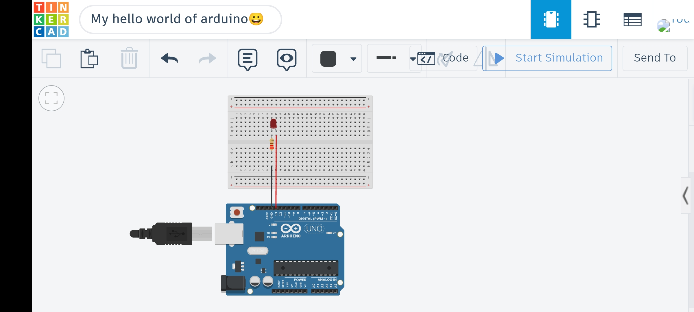

# LED Blink

## 📌 Overview
This project demonstrates how to blink an LED using an Arduino.  
It is one of the simplest and most fundamental projects in electronics and embedded systems.

The LED turns ON and OFF repeatedly with a fixed time delay, helping beginners understand digital output control.

---

## 🛠 Components Used
- Arduino Uno
- 1 LED
- 1 × 220Ω Resistor
- Breadboard
- Jumper wires

---

## ⚙️ How It Works
The LED is connected to a digital pin on the Arduino.

The Arduino:
1. Sets the pin HIGH → LED turns ON  
2. Waits for a short delay  
3. Sets the pin LOW → LED turns OFF  
4. Waits again  

This cycle repeats continuously, creating a blinking effect.

---

## 🔌 Circuit Diagram

---

## 💡 Notes
- This project introduces basic Arduino programming concepts like:
  - Digital output (`HIGH` / `LOW`)
  - Timing using `delay()`
- It serves as a foundation for more advanced projects involving LEDs and sensors

---

## 🎥 Demo 
[Watch Demo](media/led_blink.mp4)
