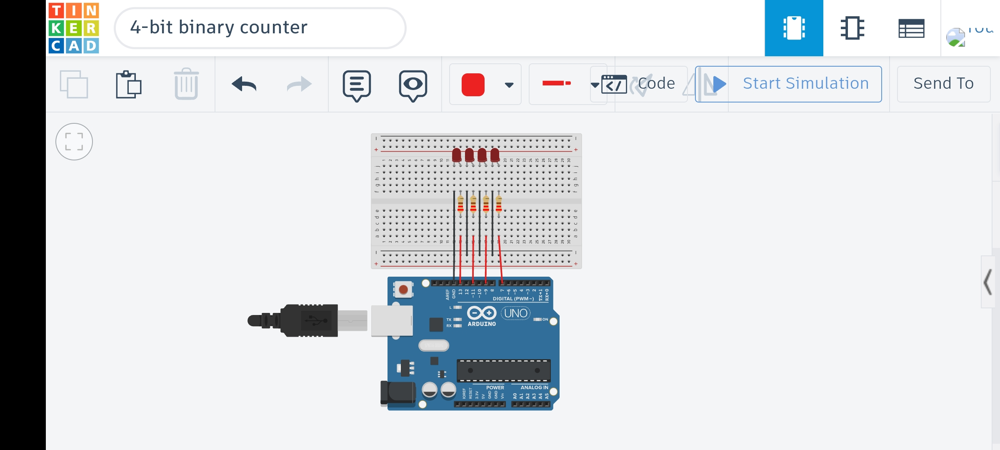

# 4-Bit Binary Counter (1–15)

## 📌 Overview
This project implements a 4-bit binary counter using LEDs.  
It counts from 1 to 15 and displays each number in binary form using four LEDs.

Each LED represents a binary bit (2⁰, 2¹, 2², 2³), allowing visualization of how binary numbers work in digital systems.

---

## 🛠 Components Used
- Arduino Uno
- 4 LEDs
- 4 × 220Ω Resistors
- Breadboard
- Jumper wires

---

## ⚙️ How It Works
Each LED is connected to a digital pin on the Arduino and represents one bit in a 4-bit number.

- LED 1 → Least Significant Bit (LSB)
- LED 4 → Most Significant Bit (MSB)

The Arduino increments a number from 1 to 15.  
For each number, it converts the value to binary and sets the LEDs HIGH or LOW accordingly.

For example:
- 1  → 0001  
- 5  → 0101  
- 10 → 1010  
- 15 → 1111  

A delay is added between each count so the changes can be observed visually.

---

## 🔌 Circuit Diagram

---

## 💡 Notes
- This project demonstrates the fundamentals of binary representation in embedded systems
- It also introduces controlling multiple outputs simultaneously

---

## 🎥 Demo 
[Watch Demo](media/4-bit_binary_counter.mp4)
