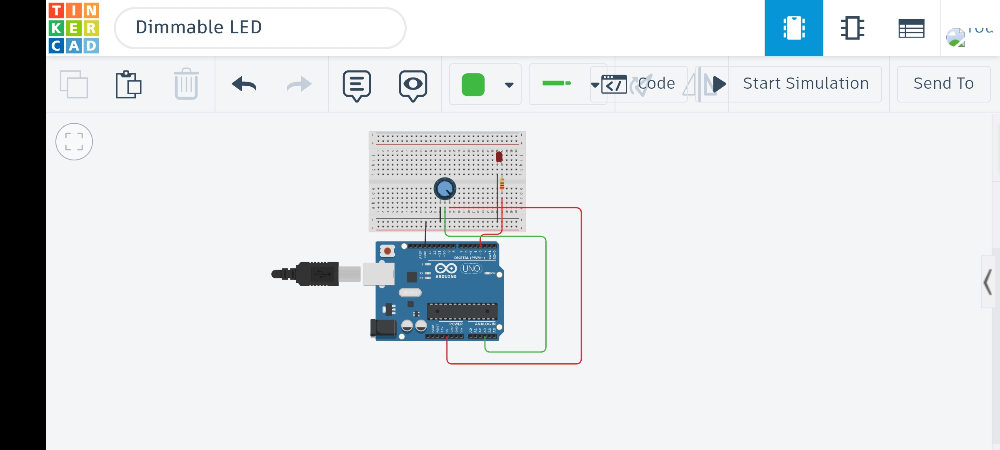

# Dimmable LED

## 📌 Overview
This project demonstrates how to control the brightness of an LED using an Arduino.  
Instead of simply turning the LED ON or OFF, the brightness is adjusted using Pulse Width Modulation (PWM).

This introduces analog-like control using digital signals.

---

## 🛠 Components Used
- Arduino Uno
- 1 LED
- 1 × 220Ω Resistor
- Breadboard
- Jumper wires
- Potentiometer (for manual control)
---

## ⚙️ How It Works
A potentiometer is used to control the brightness of the LED.

The Arduino reads the analog voltage from the potentiometer using an analog input pin.  
This value ranges from 0 to 1023 depending on the position of the knob.

The value is then mapped to a PWM range (0–255) and sent to the LED using a PWM pin.

- Turn knob → Changes analog input value  
- Arduino maps value → Adjusts PWM output  
- LED brightness changes accordingly  

Example:
- Knob at minimum → LED OFF  
- Knob at middle → Medium brightness  
- Knob at maximum → Full brightness  

This allows smooth, real-time control of the LED brightness.

## 🔌 Circuit Diagram

---

## 💡 Notes
- This project introduces:
  - PWM (Pulse Width Modulation)
  - Analog output simulation using digital pins
  - Using `analogWrite()` in Arduino
- Only specific pins (marked with `~`) support PWM on Arduino Uno

---

## 🎥 Demo
[Watch Demo](media/dimmable_led.mp4)
