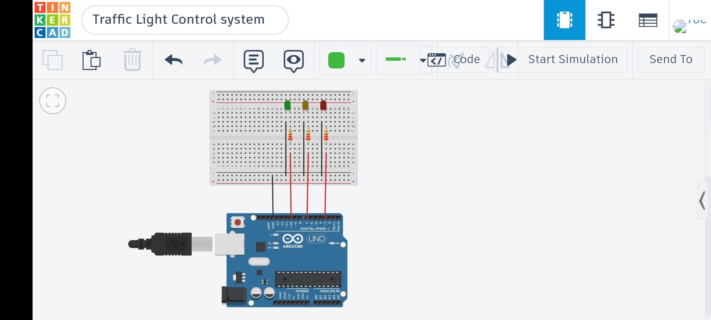

# Traffic Light Control System

## 📌 Overview
This project simulates a basic traffic light system using an Arduino and three LEDs.  
The LEDs represent the standard traffic signals: Red, Yellow, and Green.

The system cycles through the lights in a timed sequence, similar to a real-world traffic signal.

---

## 🛠 Components Used
- Arduino Uno
- 3 LEDs (Red, Yellow, Green)
- 3 × 220Ω Resistors
- Breadboard
- Jumper wires

---

## ⚙️ How It Works
Each LED represents a traffic signal and is connected to a digital pin on the Arduino.

The Arduino controls the LEDs in a fixed sequence:

1. Green light turns ON → Traffic moves  
2. Green turns OFF, Yellow turns ON → Prepare to stop  
3. Yellow turns OFF, Red turns ON → Traffic stops  

Each light stays ON for a specific duration using `delay()`:
- Green and Red → longer delay  
- Yellow → shorter delay  

This sequence repeats continuously, mimicking a real traffic light system.

---

## 🔌 Circuit Diagram

---

## 💡 Notes
- This project introduces:
  - Controlling multiple outputs
  - Sequential logic using timing delays
  - Real-world system simulation with Arduino
- Timing values can be adjusted to change signal durations

---

## 🎥 Demo
[Watch Demo](media/traffic_light_control_system.mp4)
